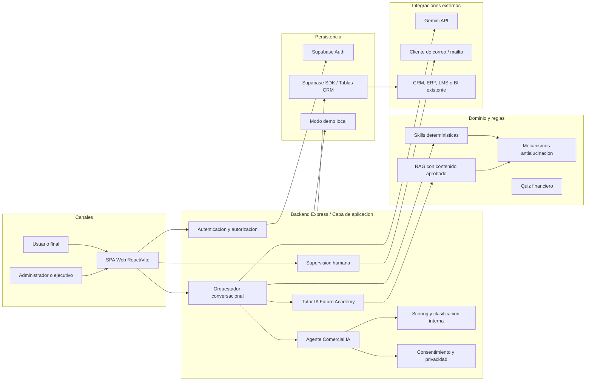

# Explicacion Tecnica Del Proyecto

## 1. Diagrama De Arquitectura

La aplicacion es una SPA unificada. No separa el chat, el tutor financiero, el CRM y el panel administrativo en productos distintos; todos conviven en un mismo workspace con vistas condicionadas por rol.

## 2. Track Asignado

**Track 1: Inteligencia Conversacional para Ventas y Gestion de Clientes (CRM).**

El producto corresponde al caso:

> Capta, califica y nutre prospectos mientras registra el contexto comercial y educativo en el CRM.

Agentes involucrados:

- **Agente Comercial IA:** conversa con el usuario, detecta interes, presupuesto, urgencia, objeciones y clasificacion comercial interna.
- **Tutor IA para Futuro Academy:** entrega educacion financiera basada en contenido aprobado.
- **Supervisor humano:** rol administrativo que revisa acciones comerciales antes de aprobarlas, editarlas o rechazarlas.

## 3. Tipo De Negocio Al Que Aplica

La solucion aplica a negocios con ciclos de venta consultivos, donde educar al prospecto es parte del proceso comercial.

Ejemplos:

- academias financieras y plataformas de educacion;
- fintechs y servicios de bienestar financiero;
- consultoras B2B;
- aseguradoras o empresas de servicios financieros no transaccionales;
- equipos comerciales con CRM;
- organizaciones que necesitan calificar prospectos antes de derivarlos a un ejecutivo.

En el MVP, el negocio representado es **Futuro Academy**, una plataforma de educacion financiera para usuarios individuales y empresas. El sistema no ejecuta acciones sensibles automaticamente; solo propone seguimientos, mensajes o derivaciones para aprobacion humana.

## 4. Funcionamiento Tecnico

### Frontend

- React + Vite.
- SPA con autenticacion, chat, quiz, solicitudes de cliente, panel CRM, supervision humana y administracion de contenido.
- Roles principales: `USER` y `ADMIN`.
- El usuario no ve score, prioridad, B2B/B2C, fuentes RAG ni la memoria completa.
- El administrador ve clasificacion interna, puntuacion, desglose, conversaciones, solicitudes y seguimientos.

### Backend

- API Express.
- Controla autorizacion real en servidor, no solo ocultamiento visual.
- Orquesta el flujo conversacional.
- Registra conversaciones, solicitudes, quiz, leads, oportunidades y acciones propuestas.
- Redacta informacion sensible antes de enviarla al usuario.

### Agentes Y Skills

El agente usa una arquitectura de skills:

- `skillAnalyzeContext`: detecta senales comerciales y educativas.
- `skillRetrieveApprovedKnowledge`: recupera contenido aprobado.
- `skillSelectDiscoveryQuestion`: selecciona preguntas configurables y evita repetir preguntas ya respondidas.
- `skillSummarizeConversation`: mantiene continuidad del historial.
- `skillApplySafetyPolicy`: aplica reglas contra promesas, recomendaciones indebidas o respuestas sin soporte.

Gemini se usa como capa de redaccion liviana. Las decisiones criticas no dependen solo del modelo generativo.

### RAG Y Antialucinacion

El RAG contiene:

- contenido aprobado de Futuro Academy;
- base empresarial ficticia de Ecuador dividida por empresa;
- metadatos de modulo, seccion, tags y aprobacion.

El usuario recibe respuestas generadas a partir de la memoria, pero no accede directamente al contenido completo ni a las fuentes internas. Si no hay soporte aprobado, el sistema responde de forma segura.

### Supabase

Supabase se usa para:

- autenticacion;
- perfiles;
- leads;
- oportunidades;
- conversaciones;
- consentimientos;
- quiz;
- solicitudes de clientes;
- seguimientos comerciales;
- preguntas configurables;
- documentos aprobados;
- metricas administrativas.

La integracion se realiza mediante Supabase SDK y adaptadores de infraestructura. El proyecto no usa archivos SQL, migraciones SQL ni consultas SQL manuales.

## 5. Como Se Integraria A Un Sistema Empresarial Existente

La solucion puede integrarse como una capa conversacional sobre sistemas empresariales ya existentes.

### Integracion Con CRM

El CRM existente podria recibir:

- contacto o perfil del usuario;
- clasificacion comercial interna;
- score del lead;
- prioridad;
- intereses detectados;
- objeciones;
- etapa del embudo;
- resumen de conversacion;
- accion recomendada;
- mensaje propuesto;
- estado de aprobacion humana.

La integracion puede hacerse mediante API REST, webhooks o sincronizacion programada desde el backend.

### Integracion Con ERP O Core Empresarial

Para empresas con ERP, el sistema podria consultar o enviar:

- datos de clientes existentes;
- estado de contratos;
- historial de compras;
- segmentos comerciales;
- reglas de elegibilidad;
- informacion de facturacion o cuentas, cuando el caso lo permita.

Los datos sensibles deberian pasar por politicas de autorizacion, auditoria y aprobacion humana.

### Integracion Con LMS O Plataforma Educativa

Para Futuro Academy o una plataforma educativa, el tutor podria integrarse con:

- cursos disponibles;
- progreso del estudiante;
- resultados de evaluaciones;
- recomendaciones de modulos;
- certificados;
- contenido aprobado actualizado.

El RAG podria alimentarse desde documentos aprobados, repositorios internos o un CMS educativo.

### Integracion Con Canales De Comunicacion

El MVP usa correo mediante `mailto` para mantener la comunicacion bajo control humano. En una version empresarial se podria integrar con:

- Gmail o Outlook;
- WhatsApp Business;
- Slack o Teams;
- sistemas de tickets;
- calendarios para agendar reuniones.

Las comunicaciones comerciales sensibles deben permanecer como propuestas hasta que un administrador o ejecutivo las apruebe.

### Modelo De Despliegue

Una empresa podria desplegar la solucion con:

- frontend web interno o publico;
- backend API detras de autenticacion corporativa;
- Supabase como BaaS o base de datos gestionada;
- Gemini como proveedor LLM;
- conectores hacia CRM, ERP, LMS y correo;
- politicas de auditoria y permisos por rol.

## 6. Resumen De Valor

El proyecto convierte una conversacion en informacion accionable para ventas y educacion:

- atiende al usuario con lenguaje natural;
- educa usando contenido aprobado;
- evita alucinaciones mediante RAG y guardrails;
- califica leads internamente;
- registra conversaciones y solicitudes;
- protege datos sensibles del usuario;
- permite supervision humana antes de acciones comerciales;
- prepara el CRM para seguimiento priorizado.

Esto permite demostrar, de extremo a extremo, un flujo funcional de captacion, educacion, calificacion, solicitud de contacto, seguimiento comercial y aprobacion humana.
